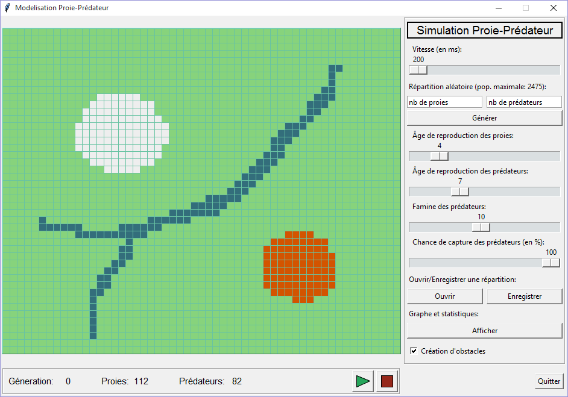
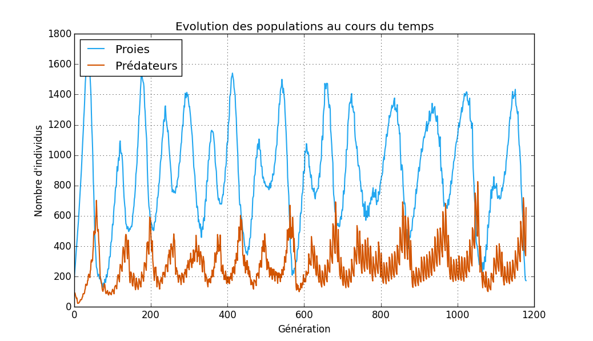

# TIPE 2016 - Étude et modélisation d’un système proie-prédateur

## Sommaire
* [A propos de ce TIPE](#a-propos-de-ce-tipe)
    * [Installation](#installation)
    * [Screenshots](#screenshots)
* [Introduction](#introduction)
* [Plan d'étude](#plan-détude)
* [Conclusion](#conclusion)
* [Bibliographie](#bibliographie)

## A propos de ce TIPE
J'ai présenté mon [TIPE](https://fr.wikipedia.org/wiki/Travail_d%27initiative_personnelle_encadr%C3%A9) en juin 2016. Le script Python est mal écrit et est parfois très lent mais il fonctionne toujours et les résultats restent intéressants.

Ce dépôt regroupe le programme de simulation, mon rapport et les transparents de présentation. Vous trouverez dessous les pré-requis d'installation ainsi que ma fiche synoptique de l'époque qui présente le projet.

### Installation
Le programme de simulation se trouve dans `script/simulation.py` et nécessite **Python 3+** avec les modules `tkinter`, `numpy`, `pickle` et `matplotlib` installés.

### Screenshots

## Introduction
La dynamique des populations est une branche des mathématiques et de l’écologie qui s’intéresse aux variations de la population d’une espèce, en tenant compte de l’influence du milieu et des interactions inter-espèces. De nos jours, avec la prise de conscience collective de la fragilité des écosystèmes, ce domaine des sciences est devenu essentiel dans la lutte pour la préservation de la faune et de la flore.

Mon étude se limite ici à un écosystème constitué de deux espèces, l’une faisant office de proie et l’autre de prédateur. De plus, l’évolution des effectifs est supposée continue dans le temps et déterministe, c’est-à-dire régie par des équations différentielles et par la donnée d’un état initial. 

L’objet de mon exposé est de comprendre comment modéliser théoriquement les fluctuations des populations d’un couple proie-prédateur, avant d’en proposer une simulation informatique réaliste à travers l’implémentation d’un automate cellulaire graphique sous Python.

## Plan d'étude
J’aborde d’abord les équations proie-prédateur de *Lotka-Volterra* et le comportement de ses solutions pour les confronter à une évolution réelle de populations. Cette première approche me permet ainsi de poser les fondements d’une adaptation informatique, aboutissant au développement d’un automate cellulaire paramétrable et dynamique simulant le comportement des espèces dans leur habitat. C’est enfin avec ce programme que je me suis intéressé à l’influence du milieu et des variables propres aux espèces sur la dynamique et la stabilité des deux populations.

## Conclusion
Finalement, j’ai pu traduire un processus complexe sous forme d’interactions simples entre individus à l’aide de divers outils informatiques: automate cellulaire, programmation objet, interface graphique, analyse numérique, manipulation de tableaux et de graphiques; ce qui m’a ensuite permis d´interpréter le rôle de chacun des paramètres en jeu.

## Bibliographie
* Alexander Dewdney, "Sharks and fish wage an ecological war on the toroidal planet Wa-Tor", Scientific American December, 1984.
* Jean-René Chazottes & Marc Monticelli, "Sur les modèles proie-prédateur en écologie", http://www.espace-turing.fr/Sur-les-modeles-proie-predateur-en.html, 2013.
* Grégory Vial, Le système proie-prédateur de Volterra-Lotka, 2011.
* Gérard Swinnen, Apprendre à programmer avec Python 3, Eyrolles, 2012.
